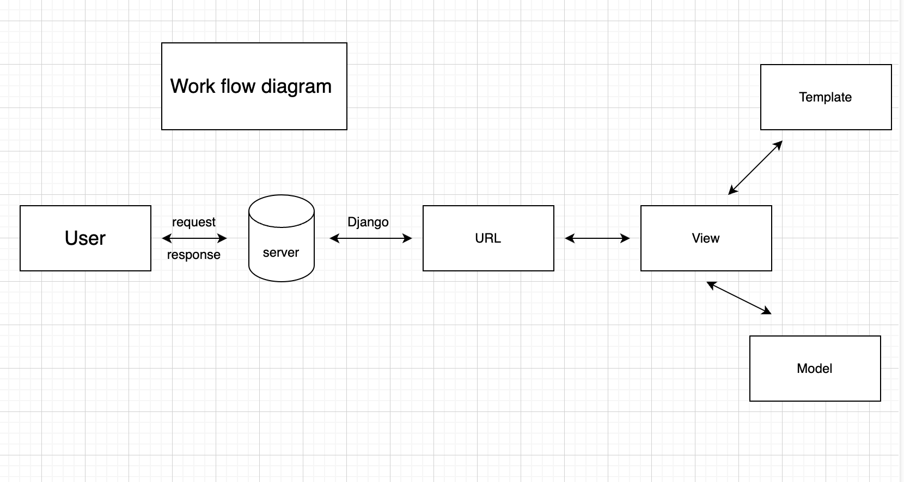

# Django Project Workflow

## 1. Django Workflow Diagram

---

## 2. Home Page
You can add a guest to the database from the home page.

---

## 3. See All Guest List
View the list of all guests.

---

## 4. Play with Query Params
Explore how query parameters work.

---

## 5. Displayed Output
Check the displayed output when user info is provided.

---

## 6. Login Page
The page for users to log in to their account.

---

## 7. Register Page
The page where users can register for an account.

---
